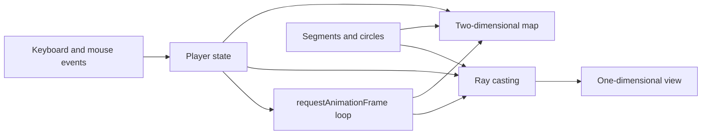

# Architecture

Flatland is a single-document browser application. `flatland.html` contains the markup, styles, world definition, raycasting logic, controls, and animation loop. This keeps the demo portable and makes the full implementation readable without a build system.

## Runtime flow



The application owns a small amount of mutable state:

- `segments` contains `{x1, y1, x2, y2, color}` objects.
- `circles` contains `{cx, cy, r, color}` objects.
- `player` contains position, facing angle, field of view, and movement constants.
- `keys` records currently pressed keys.
- `dragging` records whether a mouse drag should turn the character.

No state is persisted after the page closes.

## World representation

The raycaster understands two primitives:

1. A finite line segment.
2. A circle outline.

`addPolygon` converts every polygon edge into a segment, including the closing edge from the last point to the first. The renderer and collision check therefore do not need a separate polygon implementation.

The fixed 800 by 500 map is also the world coordinate system. The outer polygon is a boundary, and the remaining shapes are obstacles or landmarks.

## Ray intersections

All ray directions are unit vectors:

```text
direction = (cos(angle), sin(angle))
ray(t) = origin + t * direction
```

That makes a positive ray parameter `t` equal to distance in world units.

### Segment intersection

`raySegmentDist` solves the parametric equality between the ray and a segment:

```text
origin + t * rayDirection = segmentStart + u * segmentDirection
```

An intersection is accepted when `t > 0` and `0 <= u <= 1`. A near-zero determinant means the lines are parallel, so the function returns `Infinity`.

### Circle intersection

`rayCircleDist` substitutes the ray equation into the circle equation and solves the resulting quadratic. A negative discriminant means the ray misses. Otherwise the function evaluates the nearer root and returns it only when it is positive. A ray that starts inside a circle therefore returns `Infinity` rather than the distance to the far-side exit; this matches the demo's simple outline model but would need to change for robust solid-body collision.

### Closest hit

`castRay` checks every segment and circle, retaining only the smallest distance. It returns the associated color with that distance. `Infinity` represents no visible hit.

## Rendering

### One-dimensional view

`drawView` casts one ray per pixel column across the player's 60-degree field of view. A hit colors the full-height column. Its opacity is:

```text
max(0.1, 1 - distance / 500)
```

This is an illustrative depth cue rather than physically based lighting. The view intentionally has no object height, floor, ceiling, texture, or perspective correction because it represents a one-dimensional retina.

### Two-dimensional map

`drawMap` draws the source geometry, a short translucent field-of-view wedge, and the player marker. The wedge is explanatory UI; its 120-unit radius does not limit the distance used by the upper view.

## Input and movement

Keyboard listeners maintain a set of pressed keys so movement can continue across animation frames. Mouse movement turns the character while a drag that began on the view canvas remains active. A click on the map directly replaces the player's coordinates.

Before moving, `move` casts one ray in the travel direction. The move proceeds only if the nearest hit is more than the step length plus a five-unit margin away. This inexpensive check prevents simple forward or backward wall crossings, but it is not full collision detection.

## Performance characteristics

If `W` is the view width, `S` the number of segments, and `C` the number of circles, view rendering performs `O(W * (S + C))` intersection tests per frame. Map rendering is `O(S + C)`. For the current 800-column view and small fixed scene, direct iteration is simpler than a spatial index.

If the scene grows substantially, possible improvements include:

- Reducing the number of rays and scaling the result.
- Partitioning the world with a uniform grid, quadtree, or bounding volume hierarchy.
- Moving immutable scene data into precomputed typed arrays.
- Updating movement with elapsed time rather than a fixed amount per frame.

## Extension boundaries

Keep the intersection functions independent of the DOM so their math remains easy to test. New shape types should either be reduced to segments/circles or implement the same `distance or Infinity` convention. Rendering code should consume hit results without needing to know the underlying shape type.

If the project grows beyond a compact teaching demo, the natural module boundaries are world construction, geometry/intersections, input, view rendering, map rendering, and the game loop. Until then, the single-file layout is an intentional feature.
